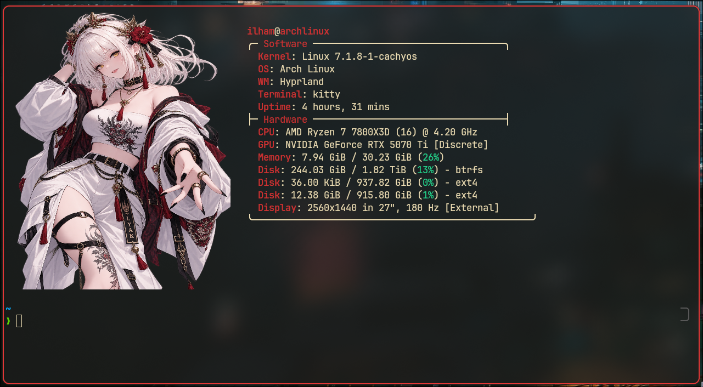

# Rangda Fastfetch

A custom Fastfetch setup for Arch Linux + Hyprland using a Rangda image with Kitty's direct image renderer.

## Preview



The preview shows the custom Rangda image, red accent labels, and the Software / Hardware layout used by this configuration.

## Features

- Rangda image logo via `kitty-direct`
- Custom Software and Hardware sections
- Red accent labels
- Integrated GPU hidden
- Designed for Kitty + Fastfetch

## Files

- `config.jsonc` — Fastfetch configuration
- `rangda.png` — logo image asset
- `screenshot.png` — setup preview

## Install

Copy `config.jsonc` to `~/.config/fastfetch/config.jsonc` and place `rangda.png` at `~/.config/fastfetch/assets/rangda.png`.

Run:

```bash
fastfetch
```
